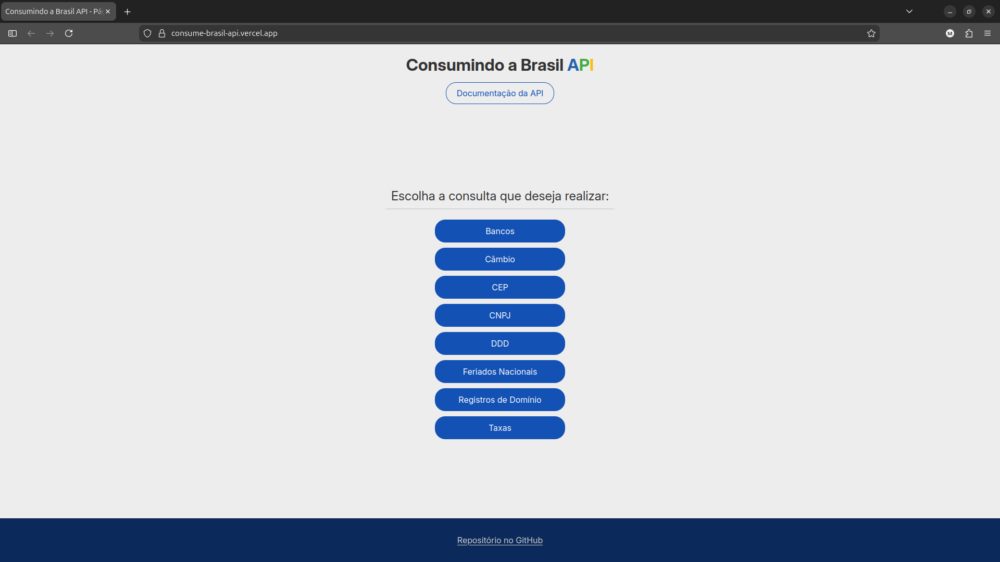
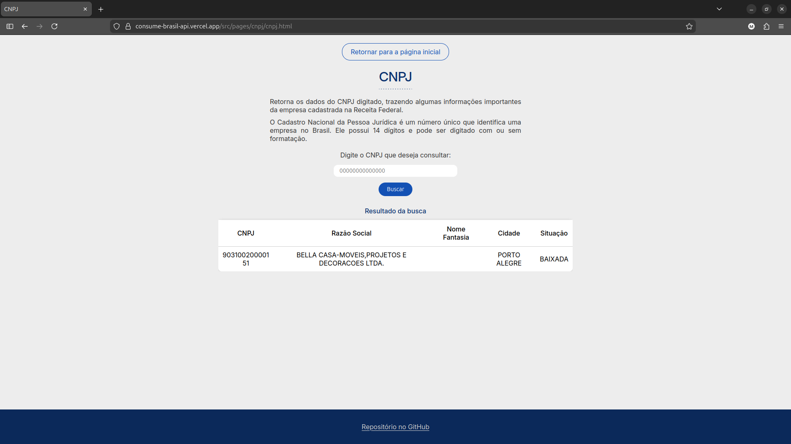
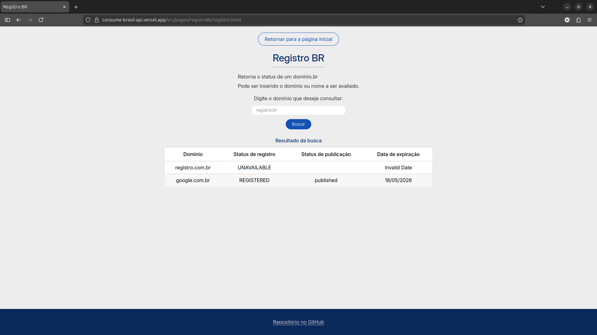
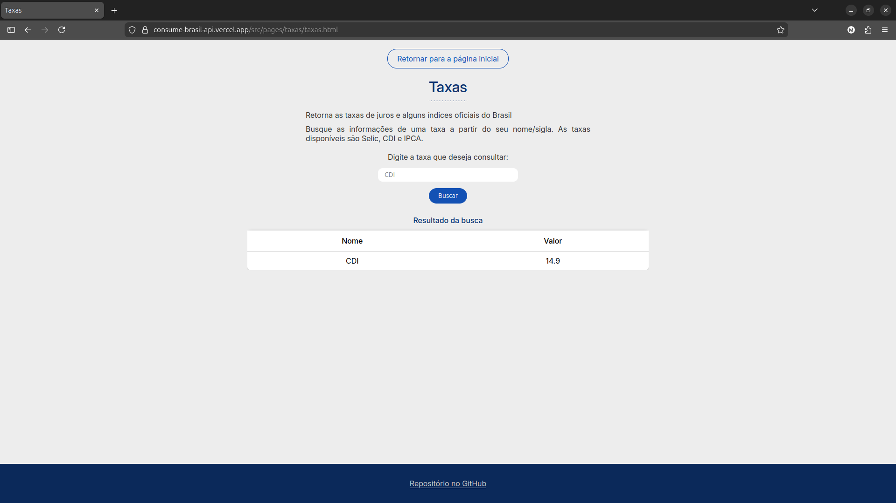

# Consume Brasil API


Aplicação web desenvolvida para **consumo de múltiplos endpoints da Brasil API**, utilizando **HTML, CSS e JavaScript**.
O projeto tem como objetivo demonstrar a integração com **APIs REST públicas**, exibindo os dados retornados de forma organizada em interface web.

A aplicação realiza consultas em diferentes serviços disponibilizados pela **Brasil API**, permitindo acessar informações públicas do Brasil de maneira rápida e simples.

Documentação oficial utilizada no projeto:
https://brasilapi.com.br/docs

---

#  Funcionalidades

O sistema permite consultar diferentes tipos de informações utilizando endpoints da Brasil API.

###  Consulta de CEP

Busca informações de endereço a partir de um CEP informado.

Dados exibidos:

* CEP
* Logradouro
* Bairro
* Cidade
* Estado

---

###  Consulta de CNPJ

Consulta dados cadastrais de empresas registradas no Brasil.

Dados exibidos:

* Razão social
* Nome fantasia
* Situação cadastral
* Município
* UF
* Data de abertura

---

###  Consulta de Feriados

Permite listar os **feriados nacionais de um determinado ano**.

Dados exibidos:

* Nome do feriado
* Data
* Tipo do feriado

---

###  Consulta de Taxas

Consulta taxas financeiras disponíveis na API.

Dados exibidos:

* Nome da taxa
* Valor
* Data de atualização

---

###  Consulta de Domínio (Registro.br)

Permite consultar informações sobre domínios registrados no **Registro.br**.

---

#  Tecnologias Utilizadas

O projeto foi desenvolvido utilizando as seguintes tecnologias:

* **HTML5**
* **CSS3**
* **JavaScript (ES6+)**
* **Fetch API**
* **Brasil API**

---

#  Estrutura do Projeto

```bash
consume-brasil-api
│
├── index.html
│
├── src
│   ├── assets
│   │   └── images
│   │
│   ├── scripts
│   │
│   ├── styles
│   │   ├── reset.css
│   │   ├── global.css
│   │   └── styles.css
│   │
│   └── pages
│       ├── cep
│       ├── cnpj
│       ├── holidays
│       ├── taxas
│       └── registroBr
```

Cada página possui seus próprios arquivos **HTML, CSS e JavaScript**, responsáveis por consumir o endpoint correspondente da API.

---

#  Como Executar o Projeto

### 1️⃣ Clonar o repositório

```bash
git clone https://github.com/SEU-USUARIO/consume-brasil-api.git
```

### 2️⃣ Acessar a pasta do projeto

```bash
cd consume-brasil-api
```

### 3️⃣ Executar o projeto

Abra o arquivo **index.html** diretamente no navegador ou utilize uma extensão como:

* **Live Server (VS Code)**

---

# Exemplo de Consumo da API

Exemplo simples de requisição utilizando **Fetch API**:

```javascript
async function buscarCEP(cep) {
    const response = await fetch(`https://brasilapi.com.br/api/cep/v1/${cep}`)
    const data = await response.json()

    console.log(data)
}
```

A resposta da API é retornada no formato **JSON** e manipulada pelo JavaScript para exibição na interface.

---

#  Prints do Projeto

Adicione aqui capturas de tela do funcionamento da aplicação.

### Página Inicial




### Consulta de CEP


### Consulta de CNPJ



### Consulta de Feriados


### Consulta de Domínio


### Consulta de Taxas



---

#  Objetivo do Projeto

Este projeto foi desenvolvido com o objetivo de praticar conceitos importantes de desenvolvimento web, como:

* Consumo de **APIs REST**
* Uso de **JavaScript assíncrono (async/await)**
* Manipulação de **JSON**
* Organização de projetos front-end
* Integração entre **interface e dados externos**

---

#  Referências

* https://brasilapi.com.br/docs

---

# Sobre o projeto

Projeto acadêmico voltado para prática de **integração com APIs públicas** e desenvolvimento web front-end.
